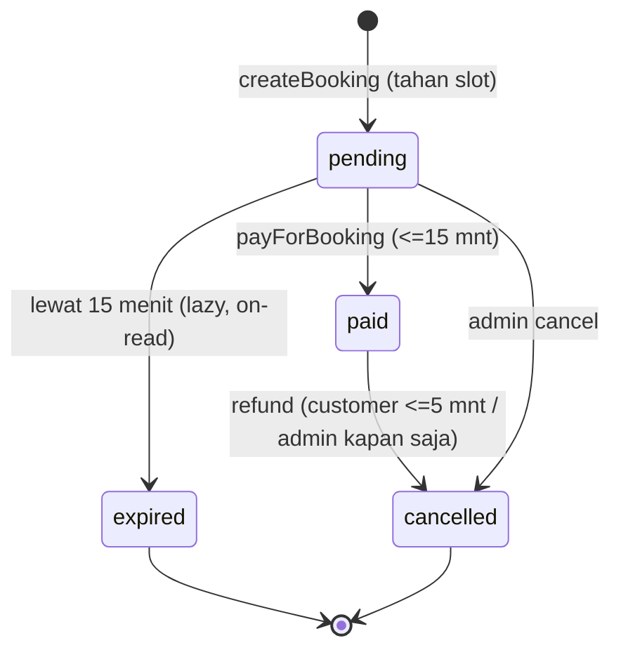

# Brief Presentasi PadelKuy — untuk Gemini Canvas

> **Instruksi untuk Gemini:** Buatkan file presentasi (slide deck) berdasarkan
> brief ini. Bahasa **Indonesia**, nada profesional & teknis, untuk **demo final
> mata kuliah Pemrograman Web** di hadapan dosen penguji. Target ±18–20 slide.
> Tiap heading di Bagian 4 = satu slide; bullet = isi slide. Untuk slide teknis,
> tampilkan potongan **kode/SQL** dari Lampiran (Bagian 8) sebagai gambar/blok kode.
> Gunakan tema warna Bagian 5. Sertakan ERD (slide 6) dan flowchart lifecycle
> (slide 9). Jangan menambah fitur yang tidak disebut. Jangan overclaim (Bagian 7).

---

## 1. Ringkasan Proyek

- **Nama:** PadelKuy
- **Apa:** Aplikasi web pemesanan **lapangan padel** di kota-kota Indonesia. Customer
  menjelajah venue, pilih lapangan & jam, lalu memesan dan membayar slot.
- **Konteks:** Proyek mata kuliah, dibangun **native** (tanpa fullstack framework,
  tanpa Node/TypeScript, tanpa build tool) sesuai batasan tugas.
- **Status:** Backend selesai & teruji (**114 unit test hijau**), **live** di Railway,
  frontend customer sudah terhubung ke API.

## 2. Masalah & Solusi

- **Masalah:** Pemesanan lapangan padel manual (chat/telepon) → rawan bentrok jadwal,
  tidak ada bukti bayar rapi, sulit dikelola pemilik.
- **Solusi:** Platform booking dengan ketersediaan slot real-time, siklus pembayaran
  jelas (pending → bayar → kuitansi PDF), dan panel admin untuk kelola venue +
  awasi semua pemesanan.

## 3. Fitur Utama

**Customer:** registrasi/login, jelajah venue + filter kota, lihat ketersediaan slot,
buat booking (kode `PDL-0001`), bayar (hitung mundur 15 menit), riwayat + unduh
kuitansi PDF, batal+refund dalam 5 menit.

**Admin:** CRUD venue & lapangan, atur jadwal+harga per lapangan, unggah foto, lihat
semua booking (filter + paginasi), batalkan + refund otomatis.

---

## 4. Outline Slide (tiap heading = 1 slide)

### Slide 1 — Judul
- "PadelKuy — Sistem Booking Lapangan Padel"
- Mini Project Pemrograman Web · Nama tim & peran (Backend/Frontend).

### Slide 2 — Latar Belakang & Masalah
- Booking manual, rawan bentrok, tanpa bukti bayar rapi.

### Slide 3 — Solusi & Sasaran
- Platform booking online + panel admin. Sasaran: anti double-booking, lifecycle
  pembayaran jelas, teruji.

### Slide 4 — Tech Stack & Batasan
- **PHP 8.2 + MySQL/MariaDB**, **PDO** untuk akses DB.
- Backend = **REST-ish JSON API**; Frontend HTML/CSS/JS murni via `fetch()`.
- **Batasan tugas (tampilkan eksplisit):** tanpa framework, tanpa Node/TS, tanpa
  build tool, tanpa cron, tanpa library eksternal (kuitansi PDF ditulis manual).
- Lokal: XAMPP. Deploy: Docker di Railway.

### Slide 5 — Arsitektur & Pemisahan Lapisan
- Web root = `public/`. **`lib/` (logika) + `config/` (kredensial) di LUAR web root**
  → tidak bisa di-serve browser (keamanan).
- Pola: `api/*.php` **tipis** (parse → panggil `lib/` → JSON); keputusan domain di
  `lib/` agar **unit-testable**.
- Tampilkan diagram folder (Lampiran 8.1).

### Slide 6 — Desain Basis Data (ERD)
- ERD 8 tabel + relasi (Lampiran 8.2).
- Relasi: Venue 1‑N Court, Court 1‑N Schedule, Court 1‑N Booking, **Booking 1‑1
  Payment** (`payments.booking_id` UNIQUE), Venue 1‑N Facilities/Images.
- Semua FK `ON DELETE CASCADE`. **Tidak ada tabel `slots`** (availability dihitung).

### Slide 7 — Domain & Glossary
- Venue (tempat) → Court (lapangan A/B/C) → Slot (1 jam bookable) → Booking
  (reservasi rentang jam) → Payment → Refund.
- Tegaskan: slot adalah konsep **dihitung**, bukan baris di tabel.

### Slide 8 — Koneksi DB & Konvensi PDO
- `db()` = **singleton** PDO (Lampiran 8.3).
- Mode: `ERRMODE_EXCEPTION`, `FETCH_ASSOC`, **`EMULATE_PREPARES = false`** (prepared
  asli → aman dari SQL injection).
- Kredensial via **env var** (`DB_HOST/NAME/USER/PASS`), default ke lokal.

### Slide 9 — Alur Pemesanan (Booking Lifecycle)
- Flowchart status: `pending → paid` / `pending → expired` / `→ cancelled` (Lampiran 8.4).
- **Pending menahan slot**; **expired** 15 menit; **refund** 5 menit.
- Cancel = **soft** (baris tidak dihapus, hanya ganti status) → jejak & catatan refund tetap ada.

### Slide 10 — Ketersediaan Diturunkan (Derived Availability)
- Tidak menyimpan slot. Algoritma: ambil booking aktif (`status IN
  ('pending','paid')`), bangun grid jam, tandai `taken` bila ada booking yang menutup
  jam itu (Lampiran 8.5).
- Hanya booking aktif yang menahan slot → expired/cancelled otomatis bebas.

### Slide 11 — Mencegah Double-Booking (Transaksi + Lock)
- Tanpa `UNIQUE(court,date,hour)` → cek **overlap** manual.
- Rumus: `start < end_lain AND end > start_lain`.
- Dijalankan dalam **transaksi** + `SELECT ... FOR UPDATE` agar dua request bersamaan
  tidak lolos berdua (Lampiran 8.6). Konflik → **HTTP 409**.

### Slide 12 — Lazy Expiry (tanpa cron)
- Batasan: tidak boleh cron. Solusi: `pending` > 15 menit di-sweep ke `expired`
  **saat ada pembacaan** availability/list (Lampiran 8.7).
- Konsekuensi: status di DB selalu jujur untuk panel admin.

### Slide 13 — Harga Dinamis per Jadwal
- `court_schedules`: jam+harga per **day band** (`everyday`/`mon_fri`/`sat_sun`),
  **band spesifik mengalahkan everyday**.
- **Fallback:** court tanpa schedule → grid 07:00–20:00 + harga flat venue.
- **Satu sumber harga** `priceForRange()` dipakai quote & tagihan → tidak mungkin
  beda (Lampiran 8.8).

### Slide 14 — Pembayaran & Kuitansi PDF
- Pembayaran **disimulasikan**: buat baris `payments` (paid/refunded + timestamp),
  ubah booking → `paid`, dalam transaksi.
- Refund: customer (window 5 menit, cek `paid_at < NOW()-5min`) atau admin (kapan saja).
- **Kuitansi PDF ditulis manual** (PDF 1.4: objects + xref, stream tak ter-compress)
  tanpa library — sesuai batasan no-dependency (Lampiran 8.9).

### Slide 15 — Desain API & Penanganan Error
- Konvensi status: **200/201** sukses, **401** belum login, **403** bukan pemilik/
  bukan admin, **404** tidak ada, **409** bentrok, **422** input salah.
- Exception domain dipetakan ke status di endpoint (Lampiran 8.10).
- `read_body()` menerima JSON atau form; `send_json()` set header + encode.

### Slide 16 — CRUD & Pola Penyimpanan Admin
- CRUD venue/court + **replace-all** untuk child rows (facilities/images/schedules):
  `DELETE` lalu insert ulang dalam transaksi (helper transaction-aware).
- **Bulk save transaksional** `saveVenueBundle`: venue + facilities + images + courts
  + schedules dalam **satu transaksi**; satu baris gagal → rollback semua.
- Booking admin: filter (`venue_id/date/status`) + paginasi (`limit/offset/page`),
  total via header **`X-Total-Count`**.

### Slide 17 — Autentikasi & Sesi
- Password **bcrypt** (`password_hash`/`password_verify`).
- Login set **PHP session**; frontend wajib `credentials: 'include'` agar cookie sesi
  terkirim. Login mengembalikan `role` → arahkan ke halaman customer/admin.
- Guard: `require_login()` (401), `require_admin()` (403).

### Slide 18 — Keamanan (ringkas)
- Prepared statements (anti SQLi) · password hashed · kredensial di luar web root ·
  otorisasi per-endpoint · upload divalidasi (MIME via `finfo`, maks 5 MB, nama acak).

### Slide 19 — Pengujian & CI/CD
- **114 PHPUnit test** lintas: auth, availability, overlap, expiry, payment, refund,
  receipt, schedule, bulk save, upload, admin.
- `tests/bootstrap.php` bangun DB **throwaway** `padelkuy_test` dari `schema.sql`.
- **GitHub Actions** jalankan suite di service MySQL tiap push & PR.

### Slide 20 — Deploy & Penutup
- Live: https://web-production-97880.up.railway.app (Docker `php:8.2-cli`,
  `php -S 0.0.0.0:$PORT -t public`).
- Redeploy manual (`railway up`); perubahan schema produksi = **migrasi additive**.
- Ajakan: "Demo langsung sekarang."

---

## 5. Tema Visual

- Brand: neon green `#c6ff3d` (aksen) + dark charcoal `#1c1f24` (latar/teks).
- Sans-serif modern, banyak whitespace, ikon garis. Blok kode bertema gelap dengan
  highlight hijau. Konsisten satu skema (gelap atau terang).

## 6. Angka & Fakta yang Boleh Dikutip

- 8 tabel; relasi 1‑N + satu 1‑1 (booking–payment); semua FK cascade.
- 114 unit test; CI GitHub Actions; DB uji throwaway `padelkuy_test`.
- Window: **15 menit** (expiry pending), **5 menit** (refund mandiri).
- Jam operasional default 07:00–20:00. Kode booking `PDL-0001`.
- 4 venue seed × 3 lapangan (A/B/C). Upload maks 5 MB (JPEG/PNG/WebP).

## 7. Yang TIDAK Boleh Diklaim

- Pembayaran **disimulasikan**, bukan gateway nyata.
- Tidak ada email/notifikasi. Tidak ada cron (expiry lazy/on-read).
- Tidak pakai framework/build tool/library PDF eksternal.

---

## 8. Lampiran Teknis (sumber blok kode untuk slide & speaker notes)

### 8.1 Struktur folder
```
public/            web root (di-serve)
  *.html *.js css/ assets/        frontend
  api/             endpoint JSON (tipis)
  api/admin/       endpoint khusus admin (require_admin)
lib/               logika domain (di luar web root)
config/db.php      koneksi PDO (env-overridable)
tests/             PHPUnit (114 test)
schema.sql seed.sql
```

### 8.2 Skema inti (ringkas)
```sql
-- relasi 1-1: satu payment per booking
CREATE TABLE payments (
  id INT AUTO_INCREMENT PRIMARY KEY,
  booking_id INT NOT NULL UNIQUE,                 -- 1:1 dengan bookings
  amount INT NOT NULL,
  status ENUM('paid','refunded') NOT NULL DEFAULT 'paid',
  paid_at TIMESTAMP NULL, refunded_at TIMESTAMP NULL,
  FOREIGN KEY (booking_id) REFERENCES bookings(id) ON DELETE CASCADE
);
-- booking = rentang jam [start_hour, end_hour) pada satu court & tanggal
CREATE TABLE bookings (
  id INT AUTO_INCREMENT PRIMARY KEY,
  court_id INT NOT NULL, user_id INT NOT NULL, date DATE NOT NULL,
  start_hour INT NOT NULL, end_hour INT NOT NULL,
  status ENUM('pending','paid','expired','cancelled') NOT NULL DEFAULT 'pending',
  code VARCHAR(20) UNIQUE,                          -- PDL-0001
  created_at TIMESTAMP NOT NULL DEFAULT CURRENT_TIMESTAMP,
  FOREIGN KEY (court_id) REFERENCES courts(id) ON DELETE CASCADE,
  FOREIGN KEY (user_id)  REFERENCES users(id)  ON DELETE CASCADE,
  INDEX idx_court_date (court_id, date)
);
```

### 8.3 Koneksi PDO (singleton + aman)
```php
$pdo = new PDO($dsn, $user, $pass, [
    PDO::ATTR_ERRMODE            => PDO::ERRMODE_EXCEPTION,
    PDO::ATTR_DEFAULT_FETCH_MODE => PDO::FETCH_ASSOC,
    PDO::ATTR_EMULATE_PREPARES   => false,   // prepared asli, bukan emulasi
]);
```

### 8.4 Lifecycle (Mermaid)


### 8.5 Derive availability
```php
// hanya booking aktif yang menahan slot
$stmt = $pdo->prepare(
  "SELECT start_hour, end_hour FROM bookings
   WHERE court_id = ? AND date = ? AND status IN ('pending','paid')");
// untuk tiap jam bookable: taken bila start_hour <= jam < end_hour
```

### 8.6 Overlap check (transaksi + lock)
```php
$pdo->beginTransaction();
$stmt = $pdo->prepare(
  "SELECT id FROM bookings
   WHERE court_id = ? AND date = ? AND start_hour < ? AND end_hour > ?
     AND status IN ('pending','paid')
   FOR UPDATE");                 // kunci baris agar request paralel tak lolos berdua
$stmt->execute([$court_id, $date, $end, $start]);
if ($stmt->fetch()) { $pdo->rollBack(); throw new BookingConflictException(); } // 409
// ... insert booking, set code = sprintf('PDL-%04d', $id), commit
```

### 8.7 Lazy expiry (tanpa cron)
```php
$pdo->exec(
  "UPDATE bookings SET status = 'expired'
   WHERE status = 'pending'
     AND created_at < (NOW() - INTERVAL 15 MINUTE)");
// dipanggil di awal getAvailability / listUserBookings / payForBooking
```

### 8.8 Harga: satu sumber
```php
function priceForRange(PDO $pdo,int $court,string $date,int $s,int $e):int {
  $sum = 0;
  for ($h = $s; $h < $e; $h++) $sum += priceForHour($pdo,$court,$date,$h);
  return $sum;          // dipakai quote booking DAN tagihan payment
}
// priceForHour: band cocok-tanggal, spesifik > everyday, fallback harga venue
```

### 8.9 Kuitansi PDF (tanpa library)
```php
// renderPdf(): rakit PDF 1.4 manual — objects (Catalog/Pages/Page/Font/Contents),
// content stream BT/Tf/Tm/Tj per baris, tabel xref + trailer. Stream TIDAK
// di-compress agar isi (kode booking, nominal) tampil sebagai byte literal.
```

### 8.10 Pemetaan exception → HTTP status
| Exception (lib) | Status | Kapan |
|---|---|---|
| `DuplicateEmailException` | 409 | email sudah terdaftar |
| `BookingConflictException` | 409 | slot bentrok |
| `NotBookingOwnerException` | 403 | bukan pemilik booking |
| `RefundWindowClosedException` | 403 | lewat window 5 menit |
| `BookingNotPayableException` / `NotRefundableException` / `ReceiptNotAvailableException` | 422 | state tidak valid |
| `InvalidArgumentException` | 422 / 404 | input salah / data tak ada |
| (belum login) `require_login` | 401 | — |
| (bukan admin) `require_admin` | 403 | — |

### 8.11 Kontrak endpoint (ringkas)
| Method + path | Sukses | Error |
|---|---|---|
| `GET /api/venues.php[?city=]` | 200 daftar venue | — |
| `GET /api/availability.php?venue_id=&date=` | 200 grid jam/court | 422 |
| `POST /api/register.php` | 201 `{id}` | 409 · 422 |
| `POST /api/login.php` | 200 `{id,name,email,role}` + cookie | 401 |
| `POST /api/bookings.php` | 201 booking (+code,status,price) | 401·409·422 |
| `GET /api/bookings.php` | 200 daftar booking sendiri | 401 |
| `POST /api/payments.php` | 201 payment | 401·403·404·422 |
| `POST /api/cancel.php` | 200 refund | 401·403·404·422 |
| `GET /api/receipt.php?booking_id=` | 200 PDF | 401·403·404·422 |
| `GET/POST/PUT/DELETE /api/admin/venues.php` | 200/201 | 401·403·404·422 |
| `GET/POST/PUT/DELETE /api/admin/courts.php` | 200/201 | 401·403·404·422 |
| `GET/PUT /api/admin/schedules.php?court_id=` | 200 | 401·403·422 |
| `POST /api/admin/venue_save.php[?id=]` | 200/201 bundle | 401·403·404·422 |
| `POST /api/admin/upload.php` | 201 `{path}` | 401·403·422 |
| `GET/DELETE /api/admin/bookings.php` | 200 (+`X-Total-Count`) | 401·403·404 |
